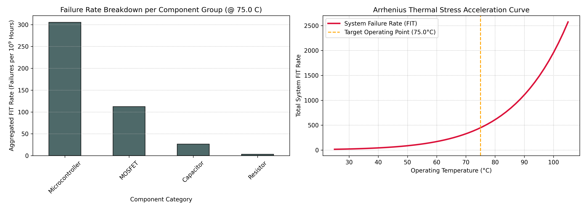

# Automated Hardware Reliability Prediction & MTBF Calculator

## 📌 Project Overview
This repository contains a hardware reliability prediction and predictive maintenance audit framework implemented in Python. In mission-critical industries (such as telecommunications, automotive electronics, and industrial automation), verifying a system's survival probability under thermal stress is mandatory prior to deployment. This tool automates the digestion of hardware Bills of Materials (BOM) and applies standard empirical models (**Telcordia SR-332 / MIL-HDBK-217F**) alongside Arrhenius thermal stress acceleration mechanics to predict key lifecycle metrics: **Failures in Time (FIT)** and **Mean Time Between Failures (MTBF)**.

## ⚡ Technical Architecture
The analytical pipeline runs through four modular assessment steps:
* **BOM Ingestion Engine:** Parses electronic design automation outputs to map specific component designators, base failure constants, and activation energies ($E_a$).
* **Arrhenius Thermal Model:** Evaluates operating temperatures against standardized baseline conditions to compute thermal stress acceleration factors ($\pi_T$) via:
  $$\pi_T = \exp\left(\frac{E_a}{k} \cdot \left(\frac{1}{T_{\text{ref}}} - \frac{1}{T_{\text{operating}}}\right)\right)$$
* **Stress Scaling:** Computes individual component degradation tracks by compiling base hazard rates, environmental operational variables ($\pi_E$), and temperature acceleration profiles.
* **System Metrics Aggregation:** Merges concurrent component hazard streams to compute total system FIT (failures per $10^9$ hours) and ultimate operational lifecycle expectation boundaries:
  $$\text{MTBF (Hours)} = \frac{10^9}{\sum \text{FIT}_{\text{components}}}$$

## 📊 Reliability Profile & Stress Analysis
The calculation engine successfully validated a high-stress deployment case study:



* **Component Vulnerability Mapping:** The breakdown graph clearly isolates high-complexity semiconductor modules (Microcontrollers, Power MOSFETs) as the dominant hazard contributors compared to passive components under elevated temperature environments.
* **Thermal Stress Curves:** The Arrhenius acceleration plot demonstrates an exponential surge in failure risks as local operational conditions escalate, proving the vital importance of thermal design and proper enclosure dissipation profiles.
* **System Quality Telemetry Output (@ 75°C):**
  * **Total Aggregated Failure Rate:** $447.39\text{ FIT}$
  * **System MTBF:** $2,235,207\text{ Hours}$ (Expected Lifetime: $255.16\text{ Years}$)

## 🛠️ How to Replicate
1. Launch the file `notebooks/hardware_reliability_calculator.ipynb` inside [Google Colab](https://colab.research.google.com/).
2. Run the processing blocks sequentially to generate sample component matrices, apply environmental multipliers, and map failure statistics.
3. The script displays structural statistics to the environment terminal and outputs high-resolution Arrhenius stress graphs.

## 📂 Repository Structure
```text
├── notebooks/          # Colab analytical execution workbooks
├── assets/             # Generated thermal acceleration curves and BOM risk profiles
└── README.md           # Professional project documentation
